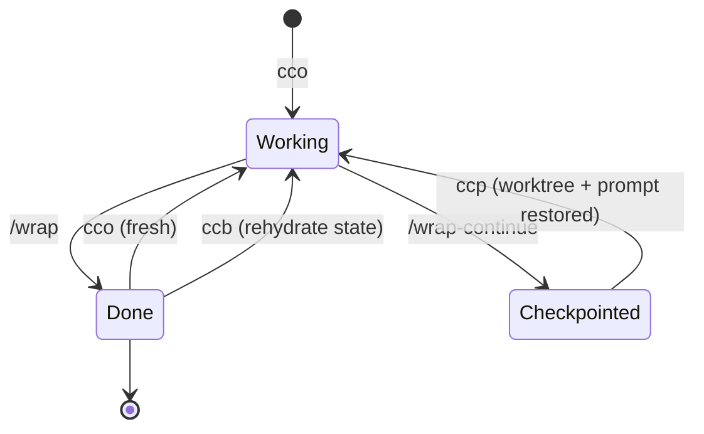
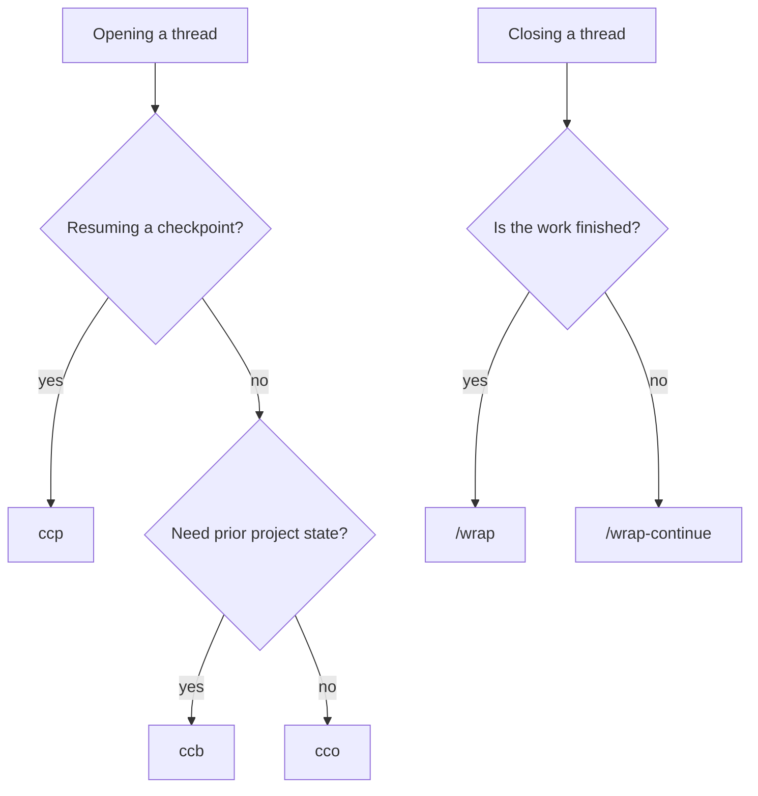

# agent-skills

Skills I use to run Claude Code as a designer. Not a framework: a process snapshot.

---

Every session moves through the same states.



There are two ways out of a session and three ways back in. `/wrap-continue` → `ccp` is the only round trip that preserves the thread, the other two exits start fresh or rehydrate from state instead of resuming.

---

## At a glance

| Skill | Before → After |
| --- | --- |
| [`/wrap`](#wrap) | Messy end-of-day session → committed, captured, closed |
| [`/wrap-continue`](#wrap-continue) | Context filling up mid-task → committed, closed, hot-resume prompt ready |
| [`/orchestrator-boot`](#orchestrator-boot) | New orchestrator thread → context loaded, ready to work |
| [`/orchestrator-update`](#orchestrator-update) | Pending config improvements sitting unreviewed → applied and eval-checked |
| [`/orchestrator-scaffold`](#orchestrator-scaffold) | New or half-set-up project → agent and grounding files in place |
| [`/orchestrator-route`](#orchestrator-route) | Over-target ORCHESTRATOR.md → facts routed to their owners, file back in range |
| [`/gh-clean-branches`](#gh-clean-branches) | Local branches piling up → stale and merged ones pruned |
| [`/gh-pr-triage`](#gh-pr-triage) | Open PRs in a repo scattered across states → grouped by what needs action |
| [`/gh-fork-sync`](#gh-fork-sync) | Fork drifting behind upstream → synced and pushed to origin |
| [`/gh-stale-issues`](#gh-stale-issues) | Issue list drifted into noise → triaged into ready-to-run commands |

---

## What works without adopting my conventions

**Standalone, zero dependencies:** the four `gh-*` skills. They reference none of my files or tools, just the `gh` CLI.

**Self-bootstrapping:** `wrap` and `wrap-continue`. They reference `ORCHESTRATOR.md`, `BACKLOG.md`, `MEMORY.md`, and pickup files, but those are files the skills write, not prerequisites. `BACKLOG.md` gets created if it's missing, the `ORCHESTRATOR.md` step skips itself when the file doesn't exist, Linear and Second Brain are optional steps. Working session hygiene from day one, no setup required.

**Requires the pattern:** the four `orchestrator-*` skills plus the shell launchers. These assume the memory-dir convention and the companion files below. You don't build that convention by hand, `/orchestrator-scaffold` generates it, so the sequence is: curl the two companion files, run scaffold, and the rest follows.

The only thing genuinely tied to me is the shape of the convention. Adopt it and everything works, reject it and the first two tiers still run fine.

---

## Install

```bash
npx skills add seansmithworks/agent-skills --list          # browse
npx skills add seansmithworks/agent-skills --skill wrap    # one skill
npx skills add seansmithworks/agent-skills -s '*' -g       # all of them, globally
```

`-a claude-code` targets Claude Code specifically. `-g` installs to `~/.claude/skills` instead of the current project.

The orchestrator family and the launchers need three companion files that aren't skills, copy them first:

```bash
# Copy the companion files into your Claude config dir
curl -o ~/.claude/orchestrator-prompt.md \
  https://raw.githubusercontent.com/seansmithworks/agent-skills/main/templates/orchestrator-prompt.md

curl -o ~/.claude/PENDING-UPDATES.md \
  https://raw.githubusercontent.com/seansmithworks/agent-skills/main/templates/PENDING-UPDATES.md
```

```bash
mkdir -p ~/.claude/shell
curl -o ~/.claude/shell/orchestrator.zsh \
  https://raw.githubusercontent.com/seansmithworks/agent-skills/main/shell/orchestrator.zsh
echo 'source ~/.claude/shell/orchestrator.zsh' >> ~/.zshrc
```

---

## Launchers

Three ways to open an orchestrator thread, two ways to close one.

| | Close | Reopen |
| --- | --- | --- |
| Done for the day | `/wrap` | `cco` (clean slate) or `ccb` (rehydrate state) |
| Not done, out of context | `/wrap-continue` | `ccp` (worktree + prompt restored) |

`/wrap-continue` → `ccp` is the only closed loop of the four: one writes the pickup file, the other consumes it. `ccp` does nothing useful without the `wrap-continue` skill installed.

What each command does:

- **`cco`** loads the orchestrator system prompt with scaffolding only — cheap.
- **`ccb`** does the same, then runs `/orchestrator-boot` to rehydrate prior state — much more context, which is the entire reason these are two commands, not one.
- **`ccp`** is shorthand for `cco pickup`: restores the worktree and delivers the saved pickup prompt as the new thread's opening message.



Caveats: zsh only, not bash. And if you add your own `cc` shortcut for `claude`, it shadows `/usr/bin/cc`, the system C compiler, in interactive shells — this file deliberately does not ship that alias. Remote control is off by default; `export CCO_REMOTE_CONTROL=1` enables driving the session from claude.ai/code.

---

## What's here

Three families. Ten skills. All opinionated. Any single skill installs on its own with `--skill <name>`, so the per-skill install command isn't repeated below.

### Wrap family: session hygiene

Every Claude Code session ends the same two ways: you're done for the day, or you're not done but the context window is getting expensive. These are different situations that need different behavior.

### /wrap

`Messy end-of-day session → committed, captured, closed`

**When:** you're done for the day, or longer.
**Does:** runs plan reconciliation (orchestrator threads only), then commits and pushes, updates the ticket tracker, writes hot memories, refreshes orchestrator state, writes session notes, and files long-term notes. No pickup prompt, that's what `/wrap-continue` is for. Every step is optional, it skips what isn't relevant and never forces a commit if nothing changed.

### /wrap-continue

`Context filling up mid-task → committed, closed, hot-resume prompt ready`

**When:** you're recycling a long-lived thread to free context, but the work itself isn't done.
**Does:** commits and pushes (mandatory), saves anything you'd lose on context clear, and generates a hot-resume pickup prompt for the next thread. Light capture, not a retrospective, the goal is a precise handoff, not a full summary.

The distinction matters. Run the heavy end-of-day flow on a continue and you waste the tokens you were trying to save. Run the light continue flow at end-of-day and you lose capture.

### Orchestrator family: pattern hygiene

The orchestrator is a long-lived Claude Code thread that never writes code. It learns the codebase, maintains context across compactions, and delegates all implementation to subagents. These three skills maintain the orchestrator itself, not the work it does.

### /orchestrator-boot

`New orchestrator thread → context loaded, ready to work`

**When:** first activation of an orchestrator thread, or when you say "boot," "orchestrator boot," "start up," or "get up to speed on this project."
**Does:** runs the session-start sequence, picks up a task assignment if one's queued, surfaces pending config updates and scaffolding gaps without reading either file in full, reads existing project context (with a rehydration short-circuit when `ORCHESTRATOR.md` is fresh), scaffolds agent files if the project is bare, and presents a summary for confirmation before doing any work.

### /orchestrator-update

`Pending config improvements sitting unreviewed → applied and eval-checked`

**When:** you run `/orchestrator:update`, ask to check pending updates, or a session starts with unreviewed entries in the registry.
**Does:** reads `~/.claude/PENDING-UPDATES.md`, presents pending entries, applies the ones you select via subagents, and validates with your eval suite. Opt-in, nothing auto-applies. The baseline-then-eval loop is non-bypassable by design, you need a before and after signal to know if a config change regressed behavior.

### /orchestrator-scaffold

`New or half-set-up project → agent and grounding files in place`

**When:** you run `/orchestrator:scaffold`, say "scaffold this project" or "add mission brand principles," or Phase 1 boot check surfaces missing scaffolding.
**Does:** three modes. Default auto-detects what's missing. `lifecycle` scaffolds the six agent files (product, experience, craft, build, data, quality). `grounding` runs an interview to draft mission.md, brand.md, principles.md, the identity layer that survives compaction and gives every subagent a consistent product lens without you re-explaining context each session.

### /orchestrator-route

`Over-target ORCHESTRATOR.md → facts routed to their owners, file back in range`

**When:** a size gate fires, `/wrap` reports the file over its 10,000-15,000-char target range (20,000 hard max), or you say "route this" or "this file is too big."
**Does:** routes durable facts out of `ORCHESTRATOR.md` to the memory files that own them, it's a router, not a store or a log. Six gates keep it honest: never evict by recency, route to the on-demand layer instead of always-read agent files, never archive a fact that's still true, verify every fact kept a home, commit a baseline before editing, measure the whole boot set (not just the one file) before and after. Not a tidy-up pass, it triggers on size or staleness only.

The orchestrator family needs the companion files copied in Install above. Launch the thread directly with:

```bash
claude --append-system-prompt-file ~/.claude/orchestrator-prompt.md
```

### GH cleanup family: repo hygiene

Repos accumulate debt the same way context windows do, gradually, then all at once. Stale branches, ignored PRs, dusty issues. These four skills clear that debt without ceremony.

### /gh-clean-branches

`Local branches piling up → stale and merged ones pruned`

**When:** your local branch list has drifted, old feature branches are hanging around.
**Does:** detects branches whose remote is gone and feature branches already merged into main, shows a combined list, waits for confirmation, then does a safe delete. Never force-deletes without an explicit nod.

### /gh-pr-triage

`Open PRs in a repo scattered across states → grouped by what needs action`

**When:** you want a status check on your open PRs and the ones waiting on your review.
**Does:** groups PRs into your PRs needing action, PRs waiting on your review, and stale ones (14+ days), with a concrete next-action suggestion per row. Read-only.

### /gh-fork-sync

`Fork drifting behind upstream → synced and pushed to origin`

**When:** your fork's main is behind upstream and you want it caught up.
**Does:** shows how far behind you are, confirms the sync strategy, syncs, and pushes to your origin only. Hard safety rule: never pushes to upstream. That rule exists because of a real incident involving an unintentional PR opened on an upstream repo, the guard is non-negotiable.

### /gh-stale-issues

`Issue list drifted into noise → triaged into ready-to-run commands`

**When:** before a release, after a period of heavy development, or whenever the issue list needs a pass.
**Does:** triages open issues by age and last activity into buckets, no-activity (90d+), no-author-response (30d+), needs labels, needs triage, and generates ready-to-run `gh` commands per issue. Read-only, you run the commands.

---

## My stack (so you know what to swap)

These skills reference my specific setup. Here's what that means and what you'd swap:

| My tool                             | What it does                        | Swap for                                                                      |
| ------------------------------------ | ------------------------------------ | ------------------------------------------------------------------------------ |
| Linear                              | Ticket tracker                      | GitHub Issues, Jira, Notion, etc.                                             |
| Second Brain / QMD                  | Long-term searchable notes          | Obsidian, Notion, your notes system                                           |
| ORCHESTRATOR.md                     | State file for orchestrator threads | Optional, only relevant if you use the orchestrator pattern                   |
| `.claude/projects/*/memory/`        | Per-project memory dir              | Optional, Claude Code memory convention                                      |
| `~/.claude/orchestrator-prompt.md`  | Orca system prompt                  | Required for orchestrator family, copy from `templates/`                     |
| `~/.claude/PENDING-UPDATES.md`      | Config update registry              | Required for `/orchestrator:update`, copy from `templates/`                  |
| `~/.claude/projects/SCAFFOLDING.md` | Per-project scaffold version index  | Used by `/orchestrator:scaffold`, create manually |
| `~/.claude/evals/`                  | Token + behavioral regression suite | Optional. Without it, `/orchestrator:update` falls back to a `wc -c` byte-count baseline and skips the behavioral suite |

The gh cleanup skills are stack-agnostic. The wrap skills work without Linear or Second Brain, just skip those steps. The orchestrator skills require the two template files above.

---

## Skills ecosystem

These skills are built for the [open agent skills ecosystem](https://skills.sh/). Any SKILL.md-compatible harness can use them.

Browse more skills at [skills.sh](https://skills.sh/).

---

## License

MIT, see [LICENSE](LICENSE).
